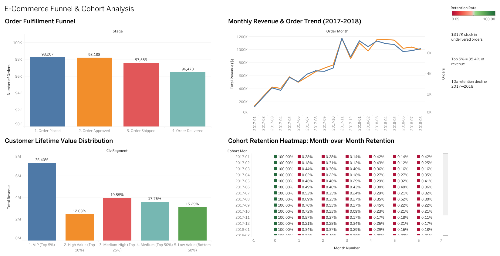

# E-Commerce Funnel & Cohort Analysis

> **Analyzing 95,000 customers and $15.8M in revenue to optimize conversion and retention**

[](https://www.postgresql.org/)
[](https://public.tableau.com)
[](https://github.com/yourusername/ecommerce-cohort-analysis)

**[📊 View Live Dashboard](https://public.tableau.com/app/profile/deven.shah/viz/ecommerce_dashboard_17713560412650/AnalysisDashboard)**

---

## 📊 Project Overview

This project analyzes 2 years of e-commerce transactional data (95,000 customers, 98,000+ orders) to identify opportunities for improving conversion rates and customer retention. Using advanced SQL techniques including window functions, CTEs, cohort logic, and RFM segmentation, I uncovered critical insights about funnel drop-off points, repeat purchase behavior, and customer lifetime value distribution.

### 🔑 Key Findings

1. **🚨 Retention Crisis:** Only **3% of customers** ever make a second purchase (industry standard: 25%+)
2. **📉 Worsening Over Time:** Cohort repeat rates collapsed **10x** from 5.38% (mid-2017) to 0.56% (mid-2018)
3. **💰 Revenue Concentration:** Top 10% of customers drive **47.4% of all revenue** ($15.8M total)
4. **😟 VIP Dissatisfaction:** Highest-value customers have the **lowest satisfaction** (3.74/5 vs 4.18/5 for low-value)
5. **🚚 $317K Stuck Revenue:** 1,729 orders approved but never delivered — immediately recoverable

---

## 🎯 Business Impact

### Key Recommendations

| Priority | Recommendation | Expected Impact |
|----------|---------------|-----------------|
| 🔴 HIGH | Fix VIP customer experience (3.74/5 satisfaction) | Protect 35% of revenue from top 5% customers |
| 🔴 HIGH | 7-day post-purchase re-engagement campaign | 38% of repeaters buy within 1 week — capture this window |
| 🔴 HIGH | Resolve 1,729 stuck orders | Recover **$317,366** in immediate revenue |
| 🟡 MEDIUM | Win-back 22,432 at-risk customers ($326 avg spend) | Reactivate high-value lapsed segment |
| 🟡 MEDIUM | Audit carriers in underperforming states (BA: 97.37%) | Late delivery drops satisfaction by **1.73 points** |
| 🟡 MEDIUM | Product recommendations for 90% single-item orders | Increase average basket size |
| 🟢 LOW | Investigate 2017→2018 retention collapse root cause | Could unlock 10x improvement in repeat rates |

---

## 📊 Interactive Dashboard

### [🔗 View Live Dashboard on Tableau Public](https://public.tableau.com/app/profile/deven.shah/viz/ecommerce_dashboard_17713560412650/AnalysisDashboard)



**Dashboard Features:**
- **Funnel Analysis:** Visual representation of 98K order journey with drop-off points
- **Revenue Trend:** Monthly growth pattern showing 2017 peak and 2018 decline
- **CLV Distribution:** Revenue concentration across customer segments
- **Cohort Heatmap:** Month-over-month retention showing the 10x collapse

---

## 🛠️ Tools & Technologies

- **Database:** PostgreSQL 18
- **SQL Client:** DBeaver Community Edition
- **Visualization:** Tableau Public
- **SQL Techniques:** Window functions, CTEs, cohort analysis, RFM segmentation, self-joins, date manipulation
- **Data Source:** [Brazilian E-Commerce Public Dataset by Olist](https://www.kaggle.com/datasets/olistbr/brazilian-ecommerce)

---

## 📁 Project Structure

```
ecommerce-cohort-analysis/
│
├── README.md                           # Project documentation (you are here)
├── CHALLENGES_AND_SOLUTIONS.md         # Technical challenges I solved
├── .gitignore                          # Excludes data files and credentials
│
├── data/
│   ├── README.md                       # Dataset information
│   └── exports/                        # CSV exports for Tableau
│       ├── funnel_data.csv
│       ├── cohort_retention.csv
│       ├── clv_segments.csv
│       └── monthly_revenue.csv
│
├── sql/
│   ├── 01_create_schema.sql            # Database schema (6 tables, indexes, constraints)
│   ├── 02_load_data.sql                # CSV import script
│   ├── 03_data_exploration.sql         # EDA - customer overview, revenue, delivery
│   ├── 04_funnel_analysis.sql          # Funnel conversion, drop-off, segmentation
│   ├── 05_cohort_analysis.sql          # Retention matrix, repeat purchase behavior
│   ├── 06_clv_segmentation.sql         # CLV calculation, RFM segmentation
│   └── 07_business_insights.sql        # Executive summary & recommendations
│
├── docs/
│   ├── methodology.md                  # My analytical approach (first-person)
│   └── business_recommendations.md     # Professional business memo format
│
└── visualizations/
    ├── dashboard_preview.png           # Full dashboard screenshot
    ├── funnel_chart.png
    ├── revenue_trend.png
    ├── clv_distribution.png
    └── cohort_heatmap.png
```

---

## 📦 Dataset Information

**Source:** Brazilian E-Commerce Public Dataset by Olist  
**Size:** ~100,000 orders | September 2016 - August 2018  
**Tables Used:** 6 core tables

| Table | Rows | Description |
|-------|------|-------------|
| olist_customers | 99,441 | Customer demographics |
| olist_orders | 99,441 | Order details and timestamps |
| olist_order_items | 112,650 | Line items and pricing |
| olist_order_payments | 103,886 | Payment information |
| olist_order_reviews | 99,224 | Customer satisfaction scores |
| olist_products | 32,951 | Product categories and attributes |

---

## 🔍 Analysis Deep Dive

### 1. 📊 Data Exploration

**Business Scale:**
- **94,990** unique customers | **98,207** total orders | **$15,810,806** total revenue
- Average order value: **$161.72** | Median order value: **$100**
- Average review score: **4.11 / 5.0**

**Customer Behavior:**
- **96.88%** are one-time customers — only **3.12%** ever return
- **90%** of orders contain just **1 item** (low basket size opportunity)
- Peak ordering hours: **10 AM - 8 PM** | Busiest day: **Monday**

**Delivery Performance:**
- **97.02%** overall delivery rate | Average delivery time: **12.1 days**
- On-time delivery: **91.89%** | Late: **8.11%**
- Late deliveries drop satisfaction from **4.29 → 2.57** (1.73 point drop)

[View SQL →](sql/03_data_exploration.sql)

---

### 2. 🔽 Funnel Analysis

**Goal:** Identify where customers drop off in the purchase journey

**Funnel Conversion:**

| Stage | Orders | Drop-off Rate |
|-------|--------|---------------|
| 1. Order Placed | 98,207 | — |
| 2. Order Approved | 98,188 | **0.02%** |
| 3. Order Shipped | 97,583 | **0.62%** |
| 4. Order Delivered | 96,470 | **1.14%** 🚨 |

**Key Findings:**
- Overall conversion rate: **98.23%** (strong!)
- Biggest drop-off: **Shipped → Delivered** (1.14%)
- **$317,366** in approved orders that never delivered (1,729 orders)
- High-value orders ($200+) have **worse** delivery rates (97.87%) than low-value (98.44%) — counterintuitive!
- **BA state** worst delivery rate (97.37%) vs **RS state** best (98.76%) — 1.4% regional gap

[View SQL →](sql/04_funnel_analysis.sql)

---

### 3. 🔁 Cohort Analysis

**Goal:** Measure customer retention by acquisition month

**Retention Summary:**

| Metric | Value |
|--------|-------|
| Average Month-1 Retention | **0.45%** 🚨 |
| Best Cohort (Jun 2017) | **5.38%** repeat rate |
| Worst Cohort (Aug 2018) | **0.56%** repeat rate |
| Average Cohort Repeat Rate | **3.38%** |

**Critical Finding — Retention Collapse:**
- Mid-2017 cohorts: **~5% repeat rate**
- Mid-2018 cohorts: **~0.5% repeat rate**
- **10x deterioration in 12 months** — structural problem, not seasonal

**Time to Second Purchase:**

| Timeframe | % of Repeat Customers |
|-----------|----------------------|
| Within 1 week | **37.67%** 🏆 |
| Within 1 month | 13.43% |
| Within 2 months | 10.53% |
| After 6 months | 17.04% |

**38% of repeat customers return within 7 days** of delivery — critical re-engagement window.

[View SQL →](sql/05_cohort_analysis.sql)

---

### 4. 💰 CLV Segmentation

**Goal:** Identify high-value customers and their revenue characteristics

**CLV Distribution:**

| Metric | Value |
|--------|-------|
| Average CLV | **$213.25** |
| Median CLV | $113.25 |
| Max CLV | $109,312.64 |
| One-time Customer % | **97%** |

**Revenue Concentration:**

| Segment | Customers | % of Customers | Revenue | % of Revenue | Avg CLV |
|---------|-----------|----------------|---------|--------------|---------|
| VIP (Top 5%) | 4,752 | 5% | $7,174,748 | **35.4%** | $1,509 |
| High Value (Top 10%) | 4,751 | 5% | $2,438,017 | **12.0%** | $513 |
| Medium-High (Top 25%) | 14,256 | 15% | $3,962,382 | **19.6%** | $278 |
| Medium (Top 50%) | 23,758 | 25% | $3,598,464 | **17.8%** | $151 |
| Low Value (Bottom 50%) | 47,511 | 50% | $3,091,195 | **15.2%** | $65 |

**⚠️ VIP Satisfaction Paradox:**

| Segment | Avg Satisfaction | % Satisfied |
|---------|-----------------|-------------|
| VIP (Top 5%) | **3.74 / 5** 🚨 | 66.87% |
| High Value (Top 10%) | 3.85 / 5 | 69.56% |
| Low Value (Bottom 50%) | **4.18 / 5** ✅ | 79.71% |

Most valuable customers are the **least satisfied** — critical churn risk requiring immediate action.

**RFM Segmentation:**

| Segment | Customers | Avg Spend |
|---------|-----------|-----------|
| **At Risk** | **22,432** 🚨 | $326 |
| Loyal Customers | 18,829 | $223 |
| Lost | 15,580 | $57 |
| Champions | 15,357 | $427 |
| New Customers | 14,725 | $57 |

**Largest segment is "At Risk"** — 22,432 customers with $326 avg spend who haven't returned.

[View SQL →](sql/06_clv_segmentation.sql)

---

## 💡 Technical Highlights

### Advanced SQL Techniques Used

- ✅ **Window Functions:** `ROW_NUMBER()`, `FIRST_VALUE()`, `PERCENTILE_CONT()`, `NTILE()`
- ✅ **Multi-level CTEs:** Complex cohort calculations with 3-4 nested CTE layers
- ✅ **Date Manipulation:** `DATE_TRUNC()`, `AGE()`, `EXTRACT(EPOCH FROM ...)` for time-based cohorts
- ✅ **Self-Joins:** Customer order sequence analysis for repeat purchase timing
- ✅ **Cohort Logic:** Acquisition cohorts with month-over-month retention tracking
- ✅ **RFM Segmentation:** `NTILE(5)` scoring across Recency, Frequency, Monetary dimensions
- ✅ **Composite Primary Keys:** Resolved duplicate `review_id` data quality issue
- ✅ **Conditional Aggregation:** `COUNT(CASE WHEN ...)` for pivot-style analysis

### Data Quality Issues Handled

- Duplicate `review_id` values in source data → Fixed with composite primary key `(review_id, order_id)`
- NULL timestamps for in-progress orders → Handled with `IS NOT NULL` filters throughout
- Ambiguous column references in multi-table JOINs → Resolved with explicit table aliases
- `FIRST_VALUE()` aggregation conflict in window functions → Refactored to CTE-based approach
- `UNION ALL` column count mismatch across sections → Separated into distinct queries per section
- PostgreSQL `PERCENTILE_CONT` can't use `OVER()` → Separated into CTE with `CROSS JOIN`

---

## 🚀 How to Start this Project

### Prerequisites
- PostgreSQL 15+ installed
- DBeaver (or another SQL client)
- Dataset from [Kaggle](https://www.kaggle.com/datasets/olistbr/brazilian-ecommerce)

### Setup Steps

1. **Clone this repository**
   ```bash
   git clone https://github.com/yourusername/ecommerce-cohort-analysis.git
   cd ecommerce-cohort-analysis
   ```

2. **Download the dataset**
   - Visit [Kaggle Olist Dataset](https://www.kaggle.com/datasets/olistbr/brazilian-ecommerce)
   - Extract CSVs to `data/` folder

3. **Create database**
   ```sql
   CREATE DATABASE ecommerce_analysis;
   ```

4. **Run scripts in order**
   ```
   01_create_schema.sql    → Creates 6 tables with indexes and constraints
   02_load_data.sql        → Update file paths, then load all CSVs
   03_data_exploration.sql → Exploratory data analysis
   04_funnel_analysis.sql  → Funnel conversion metrics
   05_cohort_analysis.sql  → Customer retention analysis
   06_clv_segmentation.sql → CLV and RFM segmentation
   07_business_insights.sql → Executive summary
   ```

   > **Note:** Update file paths in `02_load_data.sql` to match your local directory

5. **Export data for Tableau**
   - Run queries from `data/exports/` folder
   - Export results as CSV files
   - Connect Tableau Public to the CSV files

---

## 📊 Sample Queries

### Cohort Retention Calculation
```sql
-- Group customers by first purchase month
-- Track what % return in each subsequent month
WITH cohort_data AS (
    SELECT 
        cc.customer_unique_id,
        cc.cohort_month,
        EXTRACT(YEAR FROM AGE(
            DATE_TRUNC('month', o.order_purchase_timestamp), 
            cc.cohort_month)) * 12 +
        EXTRACT(MONTH FROM AGE(
            DATE_TRUNC('month', o.order_purchase_timestamp), 
            cc.cohort_month)) as months_since_cohort
    FROM customer_cohorts cc
    JOIN olist_customers c ON cc.customer_unique_id = c.customer_unique_id
    JOIN olist_orders o ON c.customer_id = o.customer_id
)
SELECT 
    cohort_month,
    ROUND(COUNT(DISTINCT CASE WHEN months_since_cohort = 1 
        THEN customer_unique_id END) * 100.0 / 
        COUNT(DISTINCT CASE WHEN months_since_cohort = 0 
        THEN customer_unique_id END), 2) as month_1_retention
FROM cohort_data
GROUP BY cohort_month
ORDER BY cohort_month;
```

### Revenue Pareto Analysis
```sql
-- Find what % of customers generate 80% of revenue
WITH ranked_customers AS (
    SELECT 
        customer_unique_id,
        total_revenue,
        SUM(total_revenue) OVER (ORDER BY total_revenue DESC) as running_total,
        SUM(total_revenue) OVER () as grand_total,
        ROW_NUMBER() OVER (ORDER BY total_revenue DESC) as rank,
        COUNT(*) OVER () as total_customers
    FROM customer_lifetime_value
)
SELECT 
    MIN(rank) as top_n_customers,
    ROUND(MIN(rank) * 100.0 / MAX(total_customers), 1) as pct_of_customers,
    ROUND(MIN(running_total) * 100.0 / MAX(grand_total), 1) as pct_of_revenue
FROM ranked_customers
WHERE running_total <= grand_total * 0.80;
```

---

## 🎓 Skills Demonstrated

- ✅ **Database Design:** Schema creation, referential integrity, indexing strategy
- ✅ **Data Quality:** Handling duplicates, NULL values, ambiguous references
- ✅ **SQL Mastery:** Window functions, multi-level CTEs, self-joins, date arithmetic
- ✅ **Business Acumen:** Identified $317K recoverable revenue and retention collapse
- ✅ **Analytical Thinking:** Surfaced non-obvious insights (VIP dissatisfaction paradox)
- ✅ **Communication:** Findings framed with business context and prioritized recommendations
- ✅ **Data Visualization:** Professional Tableau dashboard with 4 key charts
- ✅ **Problem-Solving:** Overcame 8+ technical challenges (see CHALLENGES_AND_SOLUTIONS.md)

---

## 🙏 Acknowledgments

- Dataset provided by [Olist](https://olist.com/) via [Kaggle](https://www.kaggle.com/olistbr)
- Inspired by real-world e-commerce analytics challenges

---