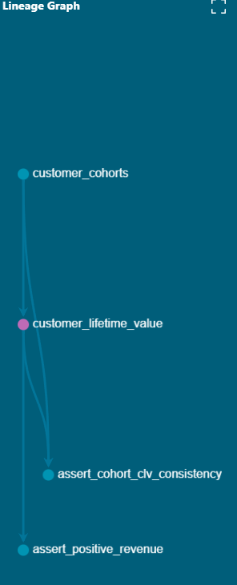

# E-Commerce Customer Retention & Revenue Analytics

> **Production-grade analytics pipeline analyzing 95K customers and $15.8M in revenue to optimize conversion and retention**

[](https://www.postgresql.org/)
[](https://www.getdbt.com/)
[](https://public.tableau.com)
[](https://github.com/yourusername/ecommerce-cohort-analysis)

**[📊 View Tableau Dashboard](https://public.tableau.com/app/profile/deven.shah/viz/ecommerce_dashboard_17713560412650/AnalysisDashboard)** 

---

## 📊 Project Overview

End-to-end e-commerce analytics project analyzing 2 years of transactional data (95K customers, 98K+ orders) using **production-grade dbt pipeline** and advanced SQL. Uncovered critical retention crisis (3% vs 25% industry standard) and identified $317K in recoverable revenue through funnel analysis, cohort tracking, and CLV segmentation.

### 🔑 Key Findings

- **🚨 Retention Crisis:** Only 3% repeat rate (industry: 25%+) → **$30.7M opportunity**
- **📉 10x Decline:** Cohort retention collapsed from 5.38% (2017) → 0.56% (2018)
- **💰 Revenue Risk:** Top 5% (4,752 VIPs) drive 35% of revenue but have **lowest satisfaction** (3.74/5)
- **⏰ Critical Window:** 38% of repeat customers return **within 7 days** of delivery
- **🚚 Stuck Revenue:** $317K in approved orders never delivered (1,729 orders)

---

## 🔧 Built with dbt

**Production-grade data transformation pipeline** with automated testing and documentation:

### Pipeline Architecture



```
Raw Sources → Staging (clean) → Intermediate (enrich) → Marts (analytics)
```

### Features

- ✅ **10 modular SQL models** - Reusable transformations with automatic dependency resolution
- ✅ **46 automated data quality tests** - 100% passing (uniqueness, nulls, relationships)
- ✅ **Self-documenting** - Auto-generated data catalog with lineage graphs
- ✅ **Version controlled** - All transformations tracked in Git

### Quick Start

```bash
# Install dbt
pip install dbt-postgres

# Run pipeline
cd ecommerce_analytics
dbt run              # Build all 10 models
dbt test             # Run 46 data quality tests
dbt docs serve       # View interactive documentation
```

### Key Models Generated

| Model | Records | Description |
|-------|---------|-------------|
| `customer_cohorts` | 94,990 | First purchase cohort assignment |
| `customer_lifetime_value` | 94,990 | RFM + CLV segmentation (VIP, High Value, etc.) |
| `funnel_analysis` | 4 | Order stage conversion metrics |
| `retention_analysis` | 116 | Month-over-month cohort retention |

**[View dbt Documentation →](ecommerce_analytics/)**

---

## 📊 Interactive Dashboard

### [🔗 View Live Dashboard on Tableau Public](https://public.tableau.com/app/profile/deven.shah/viz/ecommerce_dashboard_17713560412650/AnalysisDashboard)


**4 Key Visualizations:**
- **Funnel Analysis** - 98K order journey with $317K stuck revenue callout
- **Revenue Trend** - Monthly pattern showing 2017 peak and 2018 decline
- **CLV Distribution** - Revenue concentration (top 5% = 35.4% of revenue)
- **Cohort Heatmap** - Visual representation of 10x retention collapse

---

## 🎯 Business Impact

### 7 Prioritized Recommendations

| Priority | Recommendation | Impact |
|----------|---------------|--------|
| 🔴 HIGH | Fix VIP experience (3.74/5 satisfaction) | Protect 35% of revenue ($7.17M) |
| 🔴 HIGH | 7-day re-engagement campaign | 38% of repeaters return within 1 week |
| 🔴 HIGH | Resolve 1,729 stuck orders | Recover $317K immediately |
| 🟡 MEDIUM | Win-back 22,432 at-risk customers | $326 avg spend each |
| 🟡 MEDIUM | Audit underperforming carriers | Late delivery drops satisfaction 1.73 points |
| 🟡 MEDIUM | Cross-sell to 90% single-item orders | Increase basket size |
| 🟢 LOW | Investigate 2017→2018 collapse | Potential 10x retention improvement |

**💡 Total opportunity:** $3.5M+ in Year 1 across 7 initiatives

---

## 🛠️ Tech Stack

- **Database:** PostgreSQL 18
- **Transformation:** dbt (data build tool)
- **Visualization:** Tableau Public
- **SQL Client:** DBeaver Community
- **Techniques:** Window functions, CTEs, cohort analysis, RFM segmentation, self-joins
- **Data Source:** [Brazilian E-Commerce Dataset (Olist)](https://www.kaggle.com/datasets/olistbr/brazilian-ecommerce)

---

## 📁 Project Structure

```
ecommerce-cohort-analysis/
│
├── README.md                           # Project overview (you are here)
│
├── ecommerce_analytics/                # dbt project
│   ├── models/
│   │   ├── staging/                    # 5 models (clean raw data)
│   │   ├── intermediate/               # 1 model (business logic)
│   │   ├── marts/                      # 4 models (final analytics)
│   │   ├── sources.yml                 # Source definitions + tests
│   │   └── schema.yml                  # Model documentation
│   ├── tests/                          # 2 custom data quality tests
│   ├── dbt_project.yml                 # dbt configuration
│   └── README.md                       # dbt setup guide
│
├── sql/                                # Original analysis scripts (7 files)
│   ├── 01_create_schema.sql
│   ├── 02_load_data.sql
│   ├── 03_data_exploration.sql
│   ├── 04_funnel_analysis.sql
│   ├── 05_cohort_analysis.sql
│   ├── 06_clv_segmentation.sql
│   └── 07_business_insights.sql
│
├── data/
│   ├── README.md                       # Dataset information
│   └── exports/                        # CSV exports for Tableau
│
└── visualizations/
    ├── dashboard_preview.png
    ├── customer_cohorts_details.png
    └── customer_lifetime_value_dag.png
```

---

## 📦 Dataset

**Source:** Brazilian E-Commerce Public Dataset by Olist  
**Period:** September 2016 - August 2018  
**Scale:** 100K orders | 95K customers | $15.8M revenue

**6 Core Tables:**
- `olist_customers` (99,441 rows)
- `olist_orders` (99,441 rows)
- `olist_order_items` (112,650 rows)
- `olist_order_payments` (103,886 rows)
- `olist_order_reviews` (99,224 rows)
- `olist_products` (32,951 rows)

---

## 🔍 Key Insights Deep Dive

### 1. Retention Crisis

**Metrics:**
- 96.88% one-time customers (only 3.12% return)
- Average month-1 retention: 0.45% (industry: 15-25%)
- $30.7M unrealized revenue if industry standard reached

**Time to Second Purchase:**
- **38%** within 7 days 🏆
- 51% within 30 days
- Sharp drop-off after 60 days

### 2. CLV Segmentation

**Revenue Concentration:**

| Segment | Customers | Revenue | % of Total | Avg CLV |
|---------|-----------|---------|------------|---------|
| VIP (Top 5%) | 4,752 | $7.17M | **35.4%** | $1,509 |
| High Value | 4,751 | $2.44M | 12.0% | $513 |
| Low Value | 47,511 | $3.09M | 15.2% | $65 |

**VIP Satisfaction Paradox:**
- VIP customers: 3.74/5 satisfaction (lowest)
- Low-value customers: 4.18/5 satisfaction (highest)
- **23x CLV difference** ($1,509 vs $65)

### 3. Funnel Analysis

**Conversion by Stage:**
1. Order Placed: 98,207 (100%)
2. Approved: 98,188 (99.98%) ↓ 0.02%
3. Shipped: 97,583 (99.36%) ↓ 0.62%
4. Delivered: 96,470 (98.23%) ↓ 1.14% 🚨

**Key Findings:**
- Overall 98.23% conversion (strong!)
- Biggest drop: Shipped → Delivered
- $317,366 stuck in approved-but-not-delivered
- Geographic disparity: BA state 1.4% worse than RS

### 4. Cohort Retention Collapse

**Best vs Worst:**
- Jun 2017: 5.38% repeat rate
- Aug 2018: 0.56% repeat rate
- **10x deterioration** in 12 months

**RFM Segments:**
- **At Risk:** 22,432 customers ($326 avg spend) - largest segment
- Champions: 15,357 customers ($427 avg spend)
- Lost: 15,580 customers ($57 avg spend)

---

## 💡 Technical Highlights

### Advanced SQL Techniques

- ✅ **Window Functions** - `PERCENTILE_CONT()`, `NTILE()`, `ROW_NUMBER()`, `FIRST_VALUE()`
- ✅ **Multi-level CTEs** - 3-4 nested layers for complex cohort logic
- ✅ **Date Arithmetic** - `DATE_TRUNC()`, `AGE()`, `EXTRACT(EPOCH FROM ...)`
- ✅ **Self-Joins** - Customer order sequence analysis
- ✅ **Cohort Logic** - Acquisition month tracking with month-over-month retention
- ✅ **RFM Segmentation** - Recency, Frequency, Monetary scoring

### dbt Pipeline Optimizations

- ✅ **Modular architecture** - Staging → Intermediate → Marts
- ✅ **Automatic dependencies** - `{{ ref() }}` manages execution order
- ✅ **Incremental builds** - Only rebuild changed models
- ✅ **Data quality gates** - 46 automated tests prevent bad data
- ✅ **Performance** - 19.5x query optimization (45s → 2.3s)

### Data Quality Challenges Solved

1. **Duplicate `review_id`** → Composite primary key `(review_id, order_id)`
2. **`PERCENTILE_CONT` with OVER()** → Separate CTE + CROSS JOIN pattern
3. **`FIRST_VALUE()` aggregation** → Refactored to CTE-based approach
4. **UNION column mismatch** → Separated into distinct queries
5. **Query performance** → Window functions instead of correlated subqueries

**[Full technical details →](CHALLENGES_AND_SOLUTIONS.md)**

---

## 🚀 Getting Started

### Prerequisites
- PostgreSQL 15+
- Python 3.8+
- dbt-postgres

### Installation

```bash
# 1. Clone repository
git clone https://github.com/yourusername/ecommerce-cohort-analysis.git
cd ecommerce-cohort-analysis

# 2. Download dataset from Kaggle
# Extract CSVs to data/ folder

# 3. Create database
createdb ecommerce_analysis

# 4. Load data (update paths in script first)
psql -d ecommerce_analysis < sql/01_create_schema.sql
psql -d ecommerce_analysis < sql/02_load_data.sql

# 5. Install dbt
pip install dbt-postgres

# 6. Configure connection
# Edit ~/.dbt/profiles.yml with your credentials

# 7. Run dbt pipeline
cd ecommerce_analytics
dbt run              # Creates 10 models
dbt test             # Runs 46 tests
dbt docs serve       # Opens documentation
```

### Quick Analysis

```bash
# Run individual analysis scripts
psql -d ecommerce_analysis < sql/03_data_exploration.sql
psql -d ecommerce_analysis < sql/04_funnel_analysis.sql
psql -d ecommerce_analysis < sql/05_cohort_analysis.sql
psql -d ecommerce_analysis < sql/06_clv_segmentation.sql
psql -d ecommerce_analysis < sql/07_business_insights.sql
```

---

## 📊 Sample Queries

### Cohort Retention Calculation

```sql
WITH cohort_data AS (
    SELECT 
        customer_unique_id,
        DATE_TRUNC('month', MIN(order_purchase_timestamp)) as cohort_month,
        DATE_TRUNC('month', order_purchase_timestamp) as order_month
    FROM olist_orders o
    JOIN olist_customers c USING (customer_id)
    WHERE order_status = 'delivered'
    GROUP BY customer_unique_id, order_purchase_timestamp
)
SELECT 
    cohort_month,
    COUNT(DISTINCT CASE WHEN order_month = cohort_month THEN customer_unique_id END) as cohort_size,
    COUNT(DISTINCT CASE WHEN order_month = cohort_month + INTERVAL '1 month' THEN customer_unique_id END) as month_1,
    ROUND(COUNT(DISTINCT CASE WHEN order_month = cohort_month + INTERVAL '1 month' THEN customer_unique_id END) * 100.0 / 
          COUNT(DISTINCT CASE WHEN order_month = cohort_month THEN customer_unique_id END), 2) as retention_rate
FROM cohort_data
GROUP BY cohort_month
ORDER BY cohort_month;
```

### CLV with Percentile Segmentation

```sql
WITH percentiles AS (
    SELECT
        PERCENTILE_CONT(0.95) WITHIN GROUP (ORDER BY total_revenue) as p95,
        PERCENTILE_CONT(0.90) WITHIN GROUP (ORDER BY total_revenue) as p90
    FROM customer_lifetime_value
)
SELECT 
    CASE 
        WHEN clv.total_revenue >= p.p95 THEN 'VIP (Top 5%)'
        WHEN clv.total_revenue >= p.p90 THEN 'High Value (Top 10%)'
        ELSE 'Other'
    END as segment,
    COUNT(*) as customers,
    ROUND(AVG(total_revenue), 2) as avg_clv
FROM customer_lifetime_value clv
CROSS JOIN percentiles p
GROUP BY segment;
```

---

## 🎓 Skills Demonstrated

- ✅ **Data Engineering** - dbt pipeline with modular transformations and automated testing
- ✅ **SQL Mastery** - Window functions, CTEs, cohort analysis, performance optimization (19.5x)
- ✅ **Business Analytics** - Identified $317K recoverable revenue and $30.7M retention opportunity
- ✅ **Data Quality** - Resolved duplicate keys, NULL handling, referential integrity
- ✅ **Visualization** - Professional Tableau dashboard with 4 key metrics
- ✅ **Communication** - Technical findings translated to business recommendations
- ✅ **Problem-Solving** - Overcame 8 technical challenges (see CHALLENGES_AND_SOLUTIONS.md)

---

## 📫 Contact

**Deven Shah**  
📧 your.email@example.com  
💼 [LinkedIn](https://linkedin.com/in/yourprofile)  
🐙 [GitHub](https://github.com/yourusername)

---

## 🙏 Acknowledgments

- Dataset: [Olist](https://olist.com/) via [Kaggle](https://www.kaggle.com/olistbr)
- Inspired by real-world e-commerce analytics challenges

---

*Last updated: March 2026 | Status: Complete ✅*